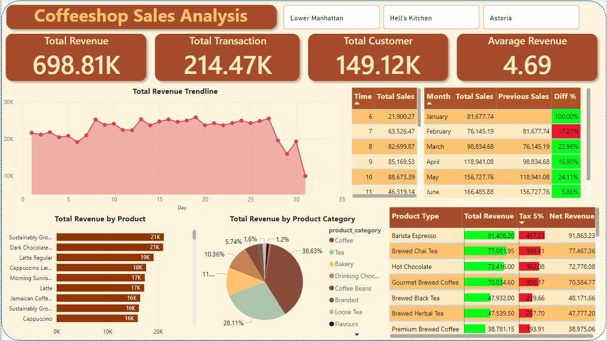
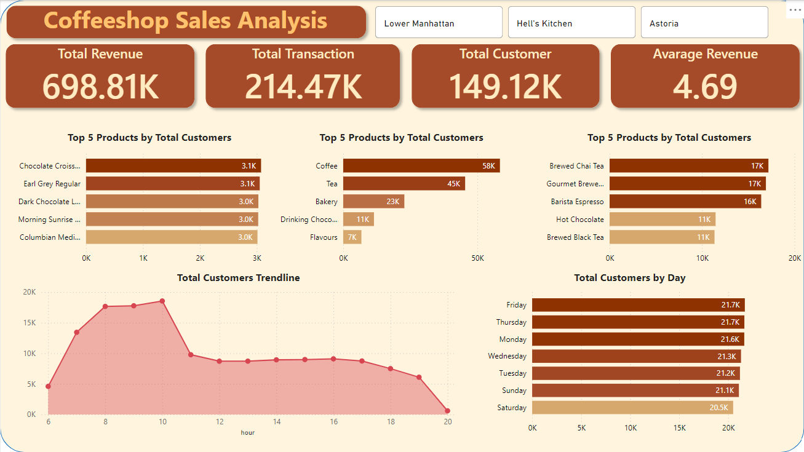

# Market Sales Analysis and Forecasting Dashboard 

## Project Overview
This project involves an end-to-end analysis of coffee sales data, from data cleaning to interactive dashboard creation and time series forecasting. The dataset used is the 'Coffee Sales' dataset, which contains transaction records for a fictitious coffee shop, Maven Roasters, operating in NYC.

## Dataset Information
- **Source**: [Kaggle - Coffee Sales Dataset](https://www.kaggle.com/datasets/ahmedabbas757/coffee-sales)
- **Description**: This dataset includes transaction records for Maven Roasters, including details such as transaction date, timestamp, location, product-level details, and sales information.
- **Data Preview**:
    - `transaction_id`: Unique sequential ID representing an individual transaction
    - `transaction_date`: Date of the transaction (MM/DD/YY)
    - `transaction_time`: Timestamp of the transaction (HH:MM:SS)
    - `transaction_qty`: Quantity of items sold
    - `store_id`: Unique ID of the coffee shop where the transaction took place
    - `store_location`: Location of the coffee shop where the transaction took place
    - `product_id`: Unique ID of the product sold
    - `unit_price`: Retail price of the product sold
    - `product_category`: Description of the product category
    - `product_type`: Description of the product type
    - `product_detail`: Description of the product detail

## Workflow

### 1. Data Cleaning
- Added a `total_payment` column by multiplying `transaction_qty` and `unit_price`.
- Converted the `transaction_date` and `transaction_time` columns into a `datetime` format.
- Performed text transformations for standardization.

### 2. MySQL Analysis
**Problem Statements**:
- What is the total revenue generated from all transactions?
- What is the total quantity of products sold across all transactions?
- How many customers have made transactions?
- What is the average revenue generated per transaction?
- What is the average number of products sold per transaction?
- How does each product category contribute to total sales, and what is the percentage contribution?
- During which hour do transactions generate the most revenue?
- What is the monthly profit growth based on total sales?
- Which products have the highest and lowest total sales?
- Which products are the most expensive and cheapest based on unit price?
- Which products are the most and least frequently purchased by customers?
- On which day of the week do transactions generate the highest revenue?
- On which day of the week do certain product categories sell the most?
- What is the average price of each product category?
- Which coffee products have the highest sales and transaction volumes?
- Which tea products have the highest sales and transaction volumes?
- How is the price distribution of products based on unit price?

### 3. Power BI Interactive Dashboard
- Implemented SQL analysis results into an interactive Power BI dashboard for enhanced data visualization and insights.

### 4. Forecasting Time Series
- Forecasted daily sales using the following models:
    - **Random Forest Regression**
    - **Linear Regression**
    - **ARIMA**
- **Model Performance**:
    - Random Forest MSE: 345749.32
    - Linear Regression MSE: 426807.22
    - ARIMA MSE: 422905.33
- The Random Forest model performed best but requires further optimization to reduce error.